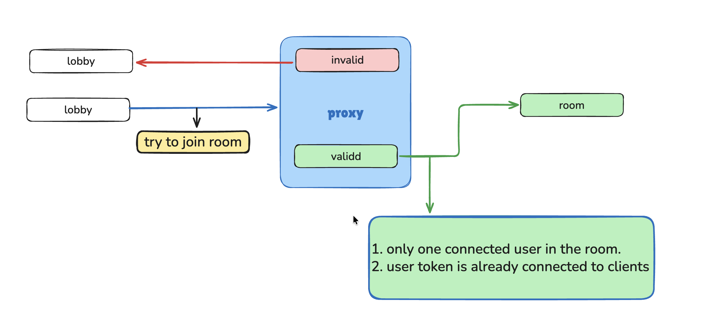
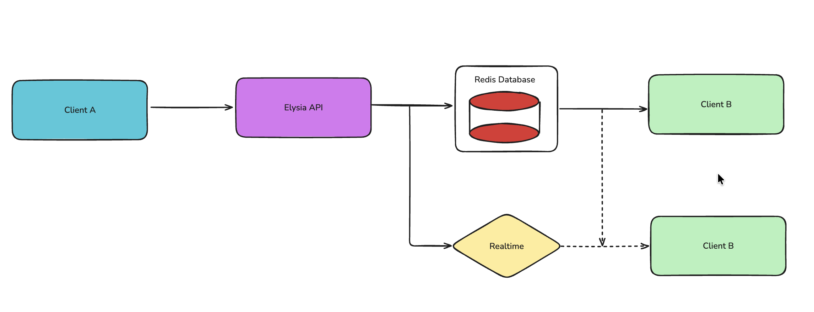

# CuteRooms: Unlimited Real-Time Presence

A high-performance, type-safe real-time room management application built with the **Bun** ecosystem. Designed to handle unlimited participants using Redis atomic operations.

## Tech Stack

- **Framework:** [Next.js 15+](https://nextjs.org/) (App Router)
- **API Engine:** [ElysiaJS](https://elysiajs.com/) (End-to-end type safety with Eden Treaty)
- **Database:** [Upstash Redis](https://upstash.com/) (Serverless Redis for global latency)
- **State Management:** [TanStack Query v5](https://tanstack.com/query/latest)
- **Styling:** [Tailwind CSS](https://tailwindcss.com/) + [JetBrains Mono](https://www.jetbrains.com/lp/mono/)
- **ID Generation:** `nanoid`

## Architecture

To support **unlimited people** without race conditions or memory bottlenecks, this app uses a "De-coupled Presence" strategy:

1.  **Room Metadata:** Stored in a Redis `HASH` for O(1) access.
2.  **Participant Tracking:** Uses Redis `SET` (`SADD`/`SCARD`) to ensure atomic joins and instant member counts, regardless of scale.
3.  **Type Safety:** The Elysia `App` type is shared with the Next.js frontend via Eden Treaty, providing full autocomplete for all API routes.


## Setup

### 1. Environment Variables
Create a `.env` file in the root directory:

```env
# Upstash Redis Configuration
UPSTASH_REDIS_REST_URL="your_url_here"
UPSTASH_REDIS_REST_TOKEN="your_token_here"

# Public URL (for Eden Treaty)
NEXT_PUBLIC_API_URL="http://localhost:3000"

```

### 2. Installation

```bash
bun install

```

### 3. Development

```bash
# Start the Next.js dev server
bun dev

```

## Project Structure

* `/src/app/api/[[...slugs]]`: ElysiaJS backend routes.
* `/src/lib/redis.ts`: Upstash Redis client configuration.
* `/src/components/providers.tsx`: TanStack Query and Theme providers.
* `/src/app/room/[roomId]`: The real-time room interface.


## The Proxy Gatekeeper
The application uses a **Proxy (Middleware)** pattern to manage room access. This ensures that every participant is tracked and validated before the page even renders.

### How it works:
1. **Request Interception:** The Proxy matches all `/room/:id` paths.
2. **Room Validation:** It performs an edge-call to Redis to verify the room exists.
3. **Session Management:** - If a user has a valid `x-auth-token`, they are granted access.
   - New users are automatically assigned a unique `nanoid` via a secure, `httpOnly` cookie.
4. **Unlimited Presence:** Users are added to a Redis **SET**, allowing the system to scale to thousands of concurrent users without write-lock issues.


## Architecture
- **Lobby:** The entry point where rooms are created.
- **Proxy:** Edge-side logic that validates rooms and handles "unlimited" joining logic.
- **Room:** The real-time destination for validated users.




# Sendig Messages
 1. **Send (Client A → API → Redis)**

- Client A** sends a message via `POST`.
- Elysia API** validates the session and writes to **Redis**.
- Redis** stores the message and resets the 
- TTL (Self-Destruct)** timer.

 1. **Broadcast (API → Realtime)**

- The API triggers an event in **Upstash Realtime**.
- The message is instantly pushed to all active room subscribers.

 3. **Receive (Realtime → Client B)**

- **Client B** receives the update via a persistent **SSE stream**.
- The UI updates automatically without a page refresh.





## License

MIT

```

---

### Implementation Tips for "Unlimited" Scalability


1.  **Atomic Joins:** Use `await redist.sadd(`presence:${roomId}`, userId)`. This prevents two people joining at once from breaking the list.
2.  **Instant Counts:** Don't fetch the list to count it. Use `await redist.scard(`presence:${roomId}`)`. It returns a single integer even if there are 1 million people.
3.  **Automatic Cleanup:** Always use `await redist.expire(key, 600)` on your presence keys to ensure old rooms don't sit in your database forever.


